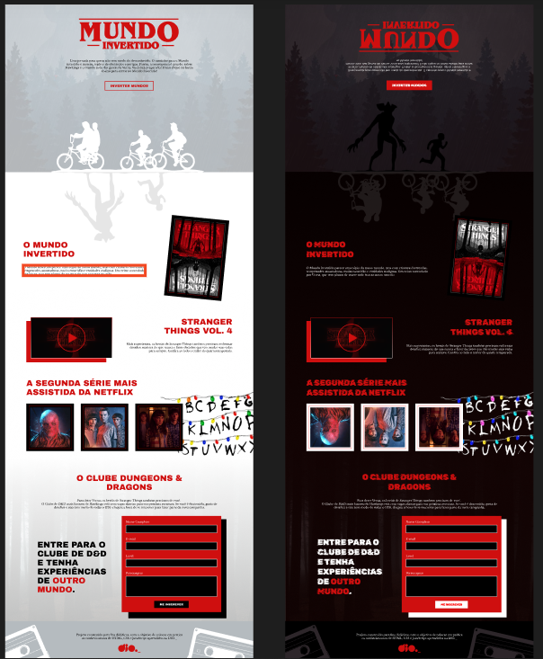

Projeto construído para fins didáticos, com o objetivo de colocar em prática os conhecimentos de HTML, CSS e JavaScript aprendidos na DIO._

  

Landing page com a temática da série Stranger Things,com  theme switcher (light e dark) e tela de cadastro com integração com firebase.

 

🎞️ [Live 01](https://www.youtube.com/watch?v=FZgIQUDn8zo) |
🎞️ [Live 02](https://www.youtube.com/watch?v=WHbhgxJLbN4) |
🎞️ [Live 03](https://www.youtube.com/watch?v=x6oegBgBcG8) 

[Figma](https://www.figma.com/file/I3Q42CcVUziRN3iMfTrbfb/Stranger-Things?node-id=0%3A1) 

### ⚒️ Semana Front-end | Dia 01: Construindo uma Landing Page no Mundo Invertido com HTML e CSS

- [x] HTML
- [x] sintax
- [x] semantic
- [x] acessibilidade
- [x] Landing Page
- [x] main
- [x] sections
- [x] audio ...
- [x] CSS3
- [x] Animações
- [x] Google fonts
- [x] variables
- [x] themes ligth dark
- [x] pseudo class
- [x] :hover
- [x] pseudo element
- [x] ::before
- [x] ::after
- [x] posicionamento
- [x] flexbox
- [x] JS
- [x] switch theme and song

### ⚒️ Semana Front-end | Dia 02: Integrando com o Firebase Para Inscrição no Clube de D&D com JavaScript 

- [x] JavaScript
- [x] document.getElementById().value
- [x] config Firabase connection    
- [x] Integração do front-end com o Firebase

### ⚒️ Semana Front-end | Dia 03: React vs. Angular: Existe Realmente uma Batalha?

Ainda a acontecer em 25/08/2022 ás 19 horas, ao vivo, live no canal da Dio no Youtube.

### Github Instrutores

[Diogo Medeiros Mainardes](https://github.com/diogomainardes)  
[Michele Queiroz Ambrosio](https://github.com/micheleambrosio)  
[Renan Johannsen de Paula](https://github.com/RenanJPaula)  

### Links Auxiliares

[DIO Digital Innovation One](https://www.youtube.com/c/DigitalInnovationOne) 

[Github DIO Projeto original](https://github.com/digitalinnovationone/semana-frontend-mundo-invertido)

[Demo](https://micheleambrosio.github.io/semana-frontend-mundo-invertido/) 

